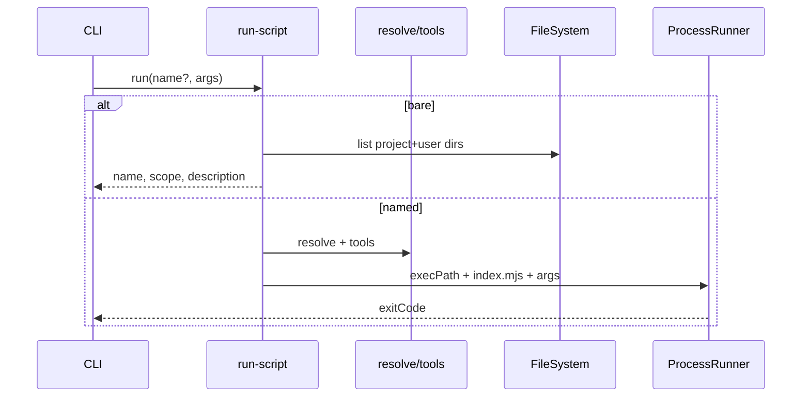

# Design: Installable catalog scripts

Approach 1: parallel `scripts` kind (skill-like tree install) under shitaku-owned roots, plus `shitaku run` via `ProcessRunner`. No concrete scripts. Maps to `scripts-install` / `scripts-run`.

## Technical Approach

Reuse skill load/plan/apply/undo/status (tree hash, conflict/force/backup) **without** `AgentTarget.skillsDir`. Roots from `Paths` + `stateDir()`:

| Scope   | Root                               |
| ------- | ---------------------------------- |
| project | `{cwd}/.shitaku/scripts/<name>/`   |
| user    | `{stateDir(home)}/scripts/<name>/` |

Catalog: `catalog/scripts/<name>/index.mjs` + `script.json`; `items.scripts`. Runtime: `process.execPath` + `index.mjs` (ESM, Node ≥22.13).

## Architecture Decisions

| Decision        | Options                                         | Tradeoff                             | Choice                                                   |
| --------------- | ----------------------------------------------- | ------------------------------------ | -------------------------------------------------------- |
| Kind model      | Parallel vs shared tree vs AgentTarget          | Dup vs skill refactor vs wrong roots | **Parallel `kind:'script'`**                             |
| Install roots   | Paths/`stateDir` vs AgentTarget                 | Shitaku state vs agent dirs          | **`scriptsDir(scope, paths)` helper**; never AgentTarget |
| Metadata        | `script.json` vs frontmatter vs `.mjs` comments | Zod structure vs skill FM vs fragile | **`script.json`** (name = dir)                           |
| Bare `run` list | Installed only vs catalog+installed             | Local inventory vs discovery         | **Installed only**; `list scripts` = catalog             |
| Doctor tools    | `info` vs `problem`                             | npx may still run                    | **`info` / `script-tool-missing`**                       |
| Tools           | `.bin` then `npx`                               | Determinism vs convenience           | Prefer local; fall back `npx`                            |
| Process I/O     | inherit vs capture                              | CLI UX vs parse                      | **inherit**; port returns exit code                      |

## Data Flow

**Install (one `--scope`):** `load → buildScriptPlan → ChangePlan.scripts → apply (FS tree + manifest)`.

**Run:**

```
shitaku run [name] [args...]
  bare → list installed (project ∪ user; project wins)
  name → project then user; reject path-like
       → tools: cwd/node_modules/.bin then npx
       → ProcessRunner(execPath, [index.mjs, ...args]) → exit passthrough
```



## File Changes

| File                                                                                     | Action        | Description                                        |
| ---------------------------------------------------------------------------------------- | ------------- | -------------------------------------------------- |
| `src/domain/catalog/script.ts`                                                           | Create        | `ScriptItem`, `ScriptMetaSchema`                   |
| `src/domain/catalog/{schema,profile,listing}.ts`                                         | Modify        | `items.scripts`, profile `scripts[]`, `LIST_KINDS` |
| `src/domain/plan/script-plan.ts`                                                         | Create        | Mirror `skill-plan`                                |
| `src/domain/plan/{change,status,doctor}-plan.ts`                                         | Modify        | `scripts[]`; doctor code                           |
| `src/domain/manifest.ts`                                                                 | Modify        | `kind:'script'` + ownership/refine                 |
| `src/domain/scripts-paths.ts`                                                            | Create        | Pure project/user root strings                     |
| `src/ports/process-runner.ts`                                                            | Create        | `run → { exitCode }`                               |
| `src/ports/prompter.ts`                                                                  | Modify        | `selectScripts`; conflict `script`                 |
| `src/application/run-script.ts`                                                          | Create        | Resolve, tools, spawn, list                        |
| `src/application/{init-mcps,installed-state,status,doctor,undo,uninstall,skill-tree}.ts` | Modify        | Script branches; reuse tree I/O                    |
| `src/adapters/catalog/folder-source.ts`                                                  | Modify        | `loadScripts`                                      |
| `src/adapters/process/node-process-runner.ts`                                            | Create        | `spawn` `shell:false`; Win `.cmd`                  |
| `src/adapters/cli/{program,clack-prompter}.ts`                                           | Modify        | `--scripts`, `run`                                 |
| `src/main.ts`                                                                            | Modify        | Wire runner + `execPath`                           |
| `catalog/*`, docs generators, README, CONTRIBUTING                                       | Modify        | Empty scripts section                              |
| `test/**`                                                                                | Create/Modify | Strict TDD; Win path fixtures                      |

## Interfaces / Contracts

```ts
export interface ProcessRunner {
  run(
    command: string,
    args: readonly string[],
    opts: {
      cwd: string;
      env?: Record<string, string | undefined>;
    },
  ): Promise<{ exitCode: number }>;
}
// script.json: name, description, tools[], optional args/output/exitCodes
```

Domain: name validation (reject `/`, `\`, `..`, drives) + tool candidate **policy**. Adapters: `spawn`, `execPath`, Windows shim pick.

## Testing Strategy

| Layer       | What                                                     | Approach                       |
| ----------- | -------------------------------------------------------- | ------------------------------ |
| Unit        | parse, plan, resolve order, path reject, tool candidates | Domain + string fixtures (Win) |
| Application | init/status/undo/uninstall/run/doctor                    | Fake FS + ProcessRunner        |
| Adapter     | folder load; exit passthrough                            | Temp dirs / stub spawn         |
| Guard       | no `child_process`/`process.` in domain                  | `architecture.test.ts`         |

## Threat Matrix

| Boundary                 | Applicability    | Design response                                          | Planned RED tests                      |
| ------------------------ | ---------------- | -------------------------------------------------------- | -------------------------------------- |
| Documentation-like paths | **Applicable**   | Spawn only `execPath` + installed `index.mjs`; name-only | Reject path-like; never spawn metadata |
| Git repository selection | **N/A** — no git | —                                                        | —                                      |
| Commit state             | **N/A**          | —                                                        | —                                      |
| Push state               | **N/A**          | —                                                        | —                                      |
| PR commands              | **N/A**          | —                                                        | —                                      |

Unknown name → non-zero + suggest bare `run`. Never `shell:true`. Doctor `info` only for missing local tools.

## Migration / Rollout

None. Chained PRs under `ask-on-risk`: schema+load → install lifecycle → run/ProcessRunner → docs. Revert PRs; orphan script rows inert.

## Open Questions

- [x] Metadata → `script.json`; bare `run` → installed; doctor → `info`
- [ ] Exact optional `args`/`output`/`exitCodes` shapes (spec may tighten)
- [ ] Share tree helpers with skills later (Approach 2) — out of scope
